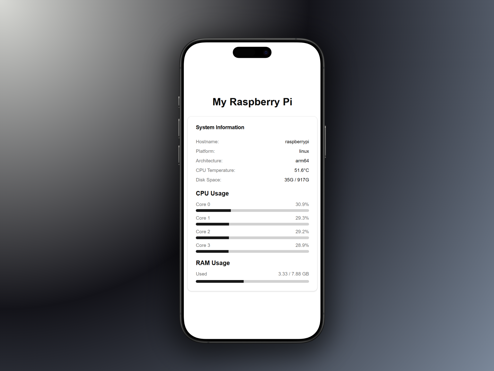

# Raspberry Pi System Monitor

A real-time system monitoring dashboard for Raspberry Pi, built with Next.js 15 and shadcn/ui. Monitor CPU usage, temperature, memory, and disk space with a clean, modern interface that updates every 5 seconds.



## Features

- **Real-time Monitoring** - Auto-refreshes every 5 seconds
- **CPU Metrics** - Per-core usage with visual progress bars
- **Temperature Tracking** - CPU temperature monitoring (requires `vcgencmd`)
- **Memory Usage** - RAM usage with percentage visualization
- **Disk Space** - Storage usage and availability
- **System Info** - Hostname, platform, and architecture details
- **Modern UI** - Built with Radix UI components and Tailwind CSS

## Tech Stack

- **Framework**: Next.js 15 (App Router)
- **UI Components**: shadcn/ui + Radix UI
- **Styling**: Tailwind CSS
- **Icons**: Lucide React
- **Language**: TypeScript

## Prerequisites

- Node.js 20+
- Raspberry Pi (or any Linux system with `vcgencmd` for temperature monitoring)

## Installation

```bash
# Clone the repository
git clone <your-repo-url>
cd statstonespi

# Install dependencies
npm install

# Run the development server
npm run dev
```

Open [http://localhost:3000](http://localhost:3000) to view the dashboard.

## Production

```bash
# Build for production
npm run build

# Start production server (runs on port 4000)
npm start
```

## API Routes

- `GET /api` - Returns system metrics in JSON format

## Project Structure

```
app/
├── api/route.ts          # System metrics API endpoint
├── layout.tsx            # Root layout with metadata
├── page.tsx              # Main dashboard page
└── system-info.tsx       # System monitoring component
lib/
└── system.ts             # System utilities (CPU, memory, disk, temp)
components/ui/            # shadcn/ui components
```

## License

MIT
